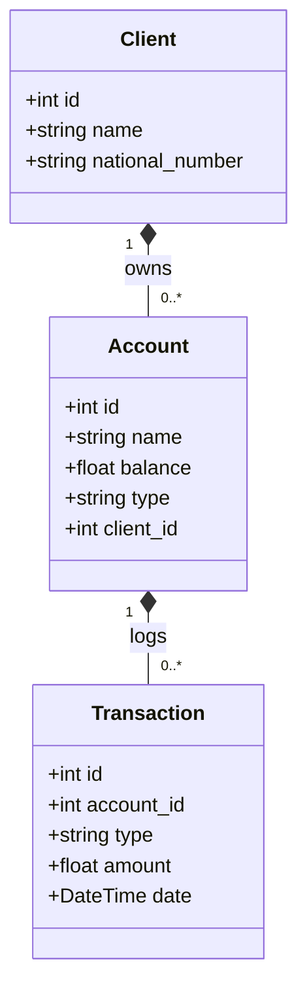
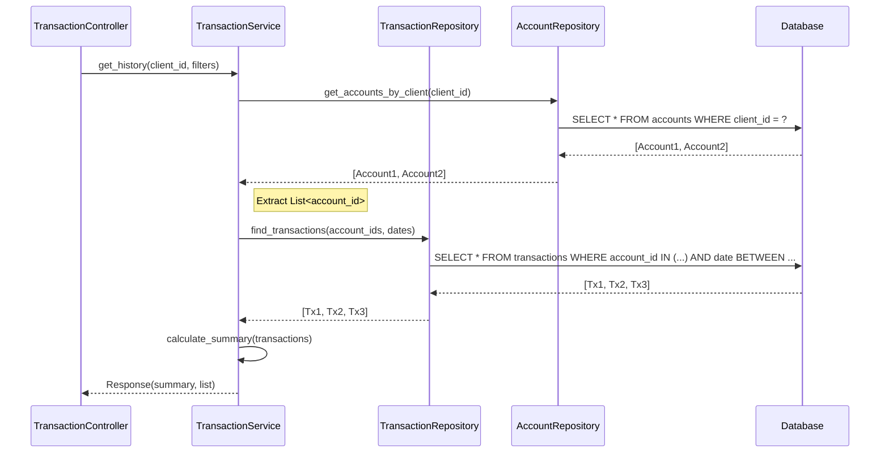
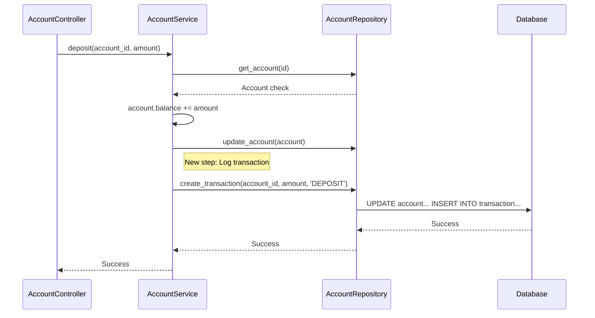

# Analysis for Developers: Transaction History

## Technical Overview
The goal is to implement a history mechanism for financial operations (deposits, withdrawals) for a client's accounts. Since currently no transaction log exists, we must introduce a new entity and update the existing services to persist this data.

## Database Schema Changes

### New Model: `Transaction`
We need a new table/model called `Transaction`.

| Field Name   | Type               | Description                                  |
| :---         | :---               | :---                                         |
| `id`         | `Integer` (PK)     | Unique identifier                            |
| `account_id` | `Integer` (FK)     | Foreign Key to `Account.id`                  |
| `type`       | `Enum/String`      | 'DEPOSIT', 'WITHDRAWAL', 'TRANSFER' (future) |
| `amount`     | `Float/Integer`    | The amount involved                          |
| `date`       | `DateTime`         | Timestamp of the operation                   |
| `created_at` | `DateTime`         | Audit timestamp                              |

### Existing Models
- **Account**: No structural changes, but logic must be updated to create a `Transaction` whenever balance changes (except perhaps initial creation).

## API Specifications

### Endpoint: GET `/clients/{client_id}/transactions`

**Parameters:**
*   `client_id` (path): ID of the client.
*   `from_date` (query, optional): timestamp.
*   `to_date` (query, optional): timestamp.
*   `account_id` (query, optional): Filter by specific account ID belonging to the client.

**Response Body:**
```typescript
interface TransactionResponse {
    summary: {
        total_incoming: number; // Sum of DEPOSITS
        total_outgoing: number; // Sum of WITHDRAWALS
    };
    transactions: Array<{
        id: number;
        account_id: number;
        amount: number;
        type: string;
        date: string;
    }>;
}
```

## Service Layer Logic

1.  **Transaction Creation**:
    - Modify `AccountService` methods `deposit` and `withdraw`.
    - After updating the account balance, create a new `Transaction` record using the same database session (atomic operation).

2.  **Transaction Retrieval**:
    - Create a new method `get_client_transactions(client_id, filters...)` in a new `TransactionService`.
    - Retrieve all accounts for the given `client_id` first.
    - Query `Transaction` table filtering by the list of account IDs.
    - Apply date ranges if provided.
    - Calculate sums for incoming vs outgoing.

## UML Diagrams

### Class Diagram (Data Structure)



### Sequence Diagram (Data Flow)

**Scenario 1: Viewing History with filters**



**Scenario 2: Creating a Transaction (Deposit)**


